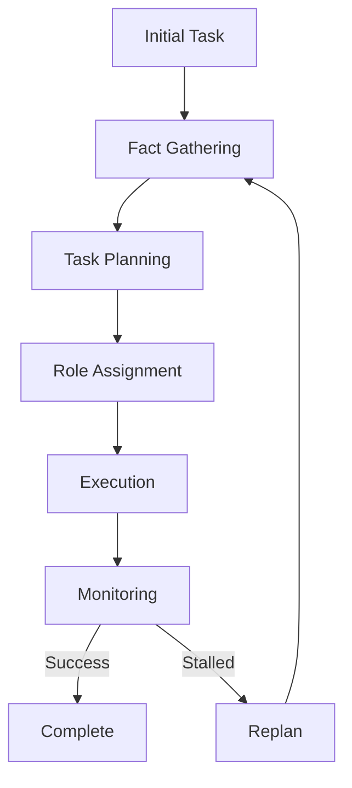

# Multi-Agent System Project


This project is a multi-agent system designed to assist with coding, analysis, and research tasks. It leverages AI to interact with users, execute code, and perform web searches for research papers. The system now includes an intuitive drag-and-drop interface for designing workflows and monitoring their progress in real-time.

## Table of Contents

- [Overview](#overview)
- [Project Structure](#project-structure)
- [Setup](#setup)
- [Usage](#usage)
- [Contributing](#contributing)
- [License](#license)

## Overview

The multi-agent system is built using Python and Docker. It includes components for web searching, code execution, and user interaction through a conversational interface. The system is designed to be extensible, allowing for the integration of additional tools and functionalities.

## High-level overview:

1. Core Differentiators:
```python
class UnifiedTeamOrchestrator:
    """Combines:
    - Real-world management principles
    - Advanced task decomposition
    - Dynamic role assignment 
    - Real-time monitoring
    - Visual workflow tracking
    """
```

2. Key Innovations:
- Fact-based planning: Uses verified facts, facts to look up, and educated guesses
- Business-inspired workflow: Based on real management experience
- Visual monitoring: Real-time tracking and visualization
- Stall detection: Identifies and handles blocked progress
- Role optimization: Matches agent capabilities to tasks

3. Architecture Flow:


4. What Sets Us Apart:
- Business-driven design vs purely academic approaches
- Real-time visualization vs black box execution
- Practical management principles vs theoretical frameworks
- Focus on tracking and improvement vs just task completion

## Project Structure

- **src/**: Contains the main source code for the agents, configuration, and execution logic.
- **tools/**: Utilities for web searching and directory structure printing.
- **scripts/**: Batch scripts for setting up and managing the Docker environment.
- **docker/**: Docker configuration files for building and running the system.

## Overview

1. Architecture Overview:
- GUI Layer: Handles visualization and user interaction
- Core System: Manages workflows, tasks, and team configuration
- Specialized Agents: Different types of AI agents for specific tasks
- Docker Environment: Provides isolated execution environment

2. Key Features:
- Intuitive drag-and-drop workflow design
- Visual workflow monitoring with node editor
- Real-time metrics tracking
- Docker containerization for safe code execution
- Specialized agent roles (Research, Code, Viz, QA, PM)
- Task decomposition and dynamic team formation

3. Main Components:
- MultiAgentSystem: Main orchestrator class
- AgentMonitor: Handles UI and visualization
- WorkflowManager: Manages agent workflows
- TeamManager: Handles agent team composition
- DockerWorkspaceManager: Manages Docker containers and volumes

4. Workflow:
1. System initialization (configuration, Docker setup)
2. Monitor setup (UI components, message queue)
3. Workflow creation and team assignment
4. Real-time monitoring and visualization
5. Graceful shutdown and cleanup

## Setup

To set up the project, follow these steps:

1. **Clone the Repository**:
   ```bash
   git clone https://github.com/pattty847/Multi-Agent-Team.git
   cd Multi-Agent-Team
   ```

2. **Create a Virtual Environment**:
   ```bash
   python -m venv .venv
   source .venv/bin/activate  # On Windows use: .venv\Scripts\activate
   ```

3. **Install Dependencies**:
   ```bash
   pip install -r requirements.txt
   ```

4. **Run Setup Script**:
   Execute the setup script to build and start the Docker containers.
   ```bash
   scripts/setup.bat
   ```

## Usage

1. **Access Jupyter Lab**:
   Use the Jupyter script to launch Jupyter Lab for interactive development.
   ```bash
   scripts/jupyter.bat
   ```

2. **Run Tasks**:
   The system can perform tasks such as web searches and code execution through the agents.

3. **Stop the System**:
   Use the stop script to stop the Docker containers when done.
   ```bash
   scripts/stop.bat
   ```

## Contributing

Contributions are welcome! Please fork the repository and submit a pull request with your changes. Ensure that your code adheres to the project's coding standards and includes appropriate tests.

## License

This project is licensed under the MIT License. See the [LICENSE](LICENSE) file for more details.
```
